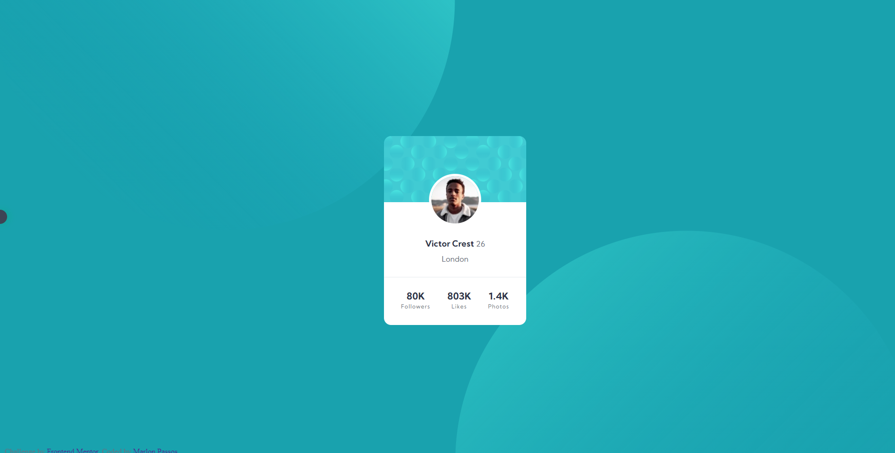

# Frontend Mentor - Profile card component solution

This is a solution to the [Profile card component challenge on Frontend Mentor](https://www.frontendmentor.io/challenges/profile-card-component-cfArpWshJ). Frontend Mentor challenges help you improve your coding skills by building realistic projects. 

### The challenge

- Create a static page where it shows a user and some information about him. Using the design image as a reference

### Screenshot

### Links

- Solution URL: [Add solution URL here](https://your-solution-url.com)
- Live Site URL: [Add live site URL here](https://your-live-site-url.com)

## My process

### Built with

- Semantic HTML5 markup
- Flexbox
- Mobile-first workflow
- Methodology BEM

### What I learned

I learned a lot about the background in this project, as I had to move with more than 1 background and know how to position it in different places using the "vw" and "vh" units.

Using variables in CSS was interesting, even being a simple project, they help and make the code prettier. I believe that when dealing with pages of various themes they will be very useful

## Author

- Frontend Mentor - [@yMarlonPassos-git](hhttps://www.frontendmentor.io/profile/MarlonPassos-git)
